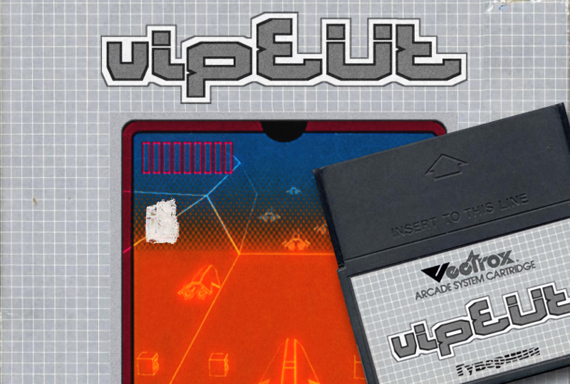
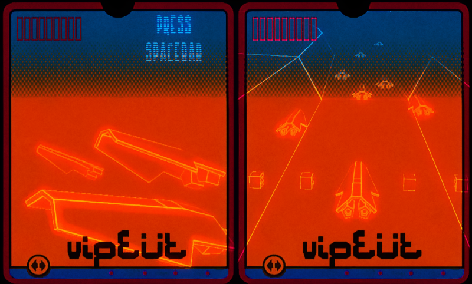

# Vipe Üt

_A game prototype made for the TigSource "Bootleg Demakes" contest in 2008._

This is the **alpha version of this VipeUt demake** that was created for a TigSource contest during the course of 1 month (mostly evenings and week-ends). The contest deadline eventually arrived so this is pretty much the latest version of this project. I might refine/reboot things some day, or I might not.

## The concept

:tiger: Around 2008, TIGSource (short for The Independent Gaming Source) hosted various game development competitions, one of which was the ["Bootleg Demake"](https://www.tigsource.com/2008/08/01/tigcompo-bootleg-demakes/) competition. In this event, participants reimagined modern or classic games as if they were made on older or simpler technology, like turning a 3D game into a 2D game or simplifying high-end graphics to mimic older consoles.

For the TIGSource "Bootleg Demakes" competition, I reimagined ["Wipe Out"](https://www.youtube.com/watch?v=XASEBvDri4U) for the [Vectrex](https://en.wikipedia.org/wiki/Vectrex), a console known for its simple vector graphics. This drastically transformed the game's visuals, adapting its high-speed, colorful environment into monochrome, vector-based imagery. Moreover, I presented this demake as if it had been bootlegged in Eastern Bloc countries before the USSR's collapse, adding a layer of historical context to the challenge.

Sound-wise, I had the chance to use one of [Christophe 'Rez' Resigné](https://twitter.com/chiptune)'s soundtracks he composed back then on a real Gameboy console. This soundtrack was close from what the actual music of a Vectrex game would sound like.

The game is implemented in [Squirrel](https://github.com/albertodemichelis/squirrel), based on [GameStart3D](https://www.youtube.com/@GameStart3D/videos). It actually run on a PC and **not** on the genuine Vectrex.

## :joystick: How to play ?

This game is a legacy program (2008) but it should _(might)_ run on a **PC Win32 machine**, with any rather recent 3D card.

During the install, you'll be prompted to deploy OpenAL. Please install it, unless you already have it, otherwise, the demo won't probably start.

The installer creates two shortcuts on the desktop, one using the **full featured renderer (OpenGL 2.0)**, the other one using a **more consusual rendering method**, not as pretty but fairly ok.

1. Download the installer from the **Release** section

2. Unzip the file in a directory, paying attention that this structure of the archive is properly extracted. It contains both the installer and the OpenAL runtime needed.

3. **Controls** : use the arrow keys. Up = accelerate, Left & Right to strafe, Down = brake. The paddle was temporarily disabled.

4. The ship have a certain amount of energy, that decreases when colliding against enemies. Then it blows up :)
Catch some bonus, that will drive the ship for you (autopilot), or increase your energy (power up). Just drive till the end, for 6 laps, and you're done :)

5. Press ESC to quit the game.

This game is really a rough alpha version, Enjoy !!!
Thanks to all the people  @[TIG Forum](https://forums.tigsource.com/index.php?topic=2422.0), that provided support & feedback.

## :vhs: Misc videos & articles

- :computer: [VipeUt Bootleg Demake](https://www.youtube.com/watch?v=WAhoYAiNYAI) video capture
- :joystick: [A real demake running on the real Vectrex](https://www.youtube.com/watch?v=1uM52IyuvSw)
- :newspaper: [VipeUt on Retro Gaming Magazine](https://web.archive.org/web/20150315020739/http://retrogamingmagazine.com/2015/03/12/vipeut-asks-what-would-wipeout-look-like-on-vectrex/)
- :memo: [VipeUt on Stiggy's blog](https://stiggyblog.wordpress.com/2011/10/22/retro-demake-vipeut/)
- :fr: [VipeUt sur le blog d'Etienne Mineur](https://web.archive.org/web/20081016070653/http://www.my-os.net/blog/index.php?2008/10/13/1136-les-demakes)
